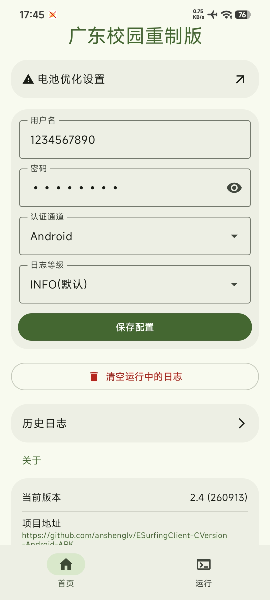
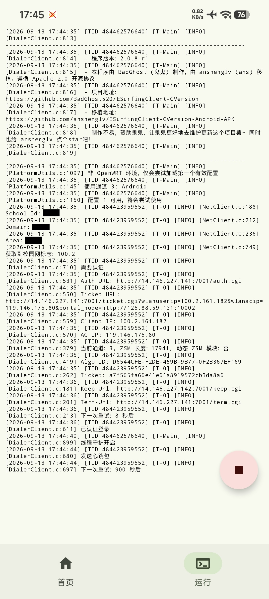

## ESurfingClient-CVersion Android 移植总结

本项目已成功将原始 C 语言编写的天翼校园网认证客户端(来自[BadGhost520](https://github.com/BadGhost520))移植为 Android 原生应用(APK)。通过 JNI 桥接和 Android 前台服务，实现了无须 shell 或 Root 权限的稳定后台认证。

[转到原作者的项目](https://github.com/BadGhost520/ESurfingClient-CVersion) | [回到原先我修改的分支](https://github.com/anshenglv/ESurfingClient-CVersion-Android-arm-v8a)

**应用运行示例：**

 

### 1. 核心架构变更
- 构建系统：从纯 CMake 迁移至 Android Gradle + CMake (NDK) 体系。
- 输出格式：由可执行二进制文件转变为共享库 (.so)，通过 JNI 被 Android 应用调用。
- 运行模式：采用 Android 前台服务 (Foreground Service) 包装 C 逻辑，确保认证进程在后台不被系统挂起，并提供持续的通知栏显示。
### 2. 原生 C 代码优化 (Native Layer)
- 权限解耦 (免 Root)：
  - 重构了 PlatformUtils.c 和 Logger.c。
  - 废弃了 /data/local/tmp 等硬编码路径，改为接收 Android 传递的应用私有数据目录 (filesDir)。这使得应用在未 Root 的普通手机上也能读写配置和日志。
- 优雅退出机制：
  - 修改了 Shutdown.c，在 Android 环境下禁用 exit() 调用，避免原生代码崩溃导致整个 App 闪退。
  - 优化了 sleep_ms 逻辑，使其能即时响应退出信号，实现秒级停止。
  - 在 work() 函数末尾增加了子线程回收 (pthread_join) 逻辑，确保清理和登出 (term()) 流程完整。
- 日志系统：增加了 Android 日志 (__android_log_print) 支持，方便在 Logcat 中调试。
### 3. JNI 桥接层设计
- 异步运行：在 native-lib.cpp 中创建独立的 pthread 运行 work() 循环，避免阻塞 Android UI 线程。
- 状态同步：通过原子标志位 (g_thread_keep_alive) 同步 Java 层与 C 层的运行状态。
### 4. Android UI/UX 实现
- 实时日志查看器：
  - 实现了每秒自动刷新机制，直接从 run.log 读取原生输出。
  - 双指缩放：支持通过捏合手势实时调整日志字体大小。
  - 自动滚动：日志更新时自动保持在最底部。
- 多语言支持：建立了完善的 strings.xml 资源体系，支持 中文 / 英文 根据系统语言自动切换。
- 沉浸式设计：
  - 适配 Edge-to-Edge 全屏显示。
  - 智能状态栏：Home 页随深/浅模式切换，日志页自动切换至全屏黑底白字模式，防止状态栏遮挡。
### 5. 体积与性能优化
- 体积削减：通过 R8 混淆、资源压缩以及原生库剥离调试符号（Symbol Stripping），将 APK 体积从初始的 15MB 压缩至 5.9MB。
- 架构精简：针对性优化了 arm64-v8a 指令集。
- 依赖管理：通过 CMake 静态链接 CURL 和 OpenSSL，解决了 Android 环境下 SSL 依赖缺失的问题。
### 6. 安全与权限
- 适配 Android 13/14+：
  - 正确声明了 FOREGROUND_SERVICE_SPECIAL_USE。
  - 实现了运行时通知权限申请。
