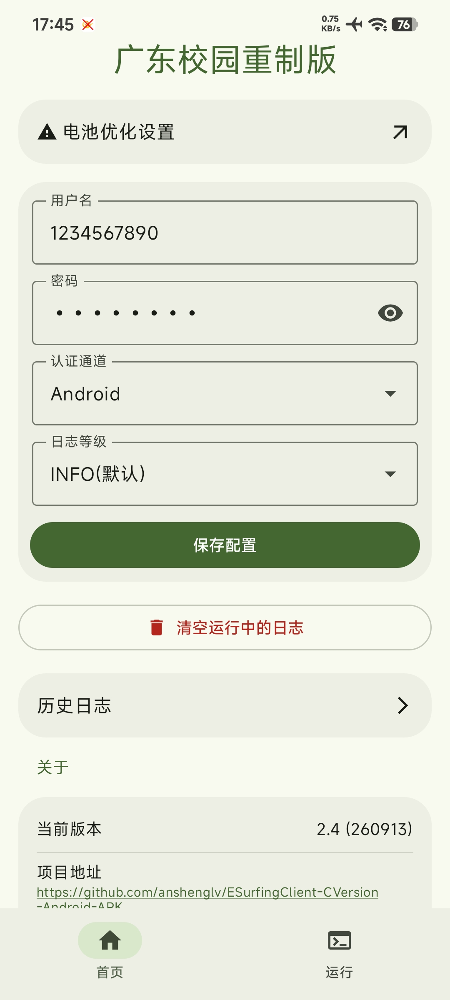
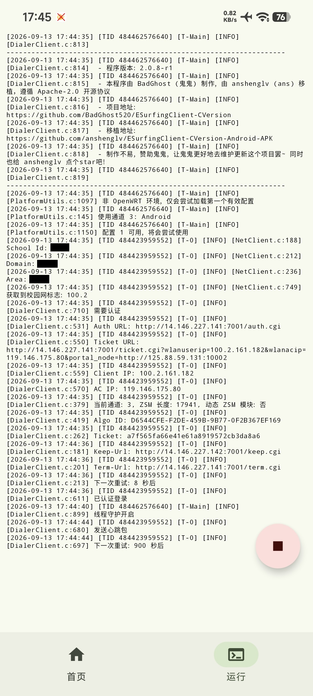
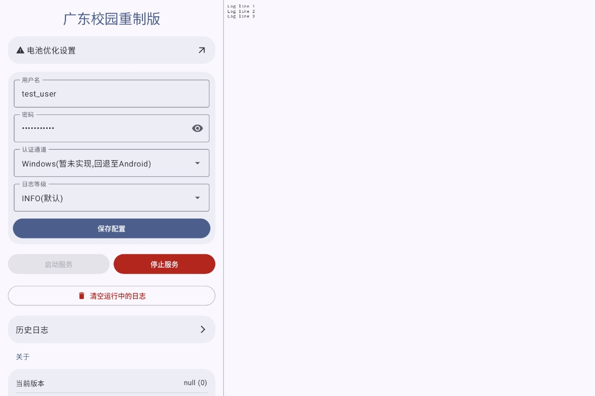

## ESurfingClient-CVersion Android 移植总结
>
>由于我对git和github的不熟悉，加上前面Push和commit时不仔细，导致一堆问题，因此我用最蠢的方法删库重建，所以之前star过的需要重新star一下。还有由于之前打的Tag就不一定匹配对应的版本，所以现在的Tag也不一定对应当时版本的代码。

本项目将原始 C 语言编写的天翼校园网认证客户端(来自[BadGhost520](https://github.com/BadGhost520))移植为 Android 原生应用(APK)，无需拥有 shell 及以上权限的安卓终端就能轻松运行。

[转到上游原作者的项目](https://github.com/BadGhost520/ESurfingClient-CVersion)

**应用运行示例：**

 

### 1. 核心架构变更
- 构建系统：从纯 CMake 迁移至 Android Gradle + CMake (NDK) 体系。
- 输出格式：由可执行二进制文件转变为共享库 (.so)，通过 JNI 被 Android 应用调用。
- 运行模式：采用 Android 前台服务 (Foreground Service) 包装 C 逻辑，并提供持续的通知栏显示。
### 2. 原生 C 代码处理
- PlatformUtils.h  ExecPath.c -> 运行路径获取安卓应用程序私有目录的路径。
- Shutdowm.c -> 移除Linux信号处理和防止重复退出的逻辑代码。
- 跳过Main.c，直接从DialerClient.c的work()启动C程序。
### 3. JNI 桥接层设计
- shut(0)独立线程执行，避免整个应用UI被阻塞和闪退。
- 状态同步：通过原子标志位(g_thread_keep_alive)，同步Java层与C层的运行状态，防止重复启动或停止。
### 4. Android UI/UX 实现
- 日志查看器：
  - 日志页只有在服务运行时每0.5秒自动从run.log读取日志并同步到应用层。
  - 增加了全面的历史日志的查看和管理，导出和分享，无需root用户自行寻找。
  - 双指缩放：支持通过捏合手势实时调整日志字体大小，但是最好横向捏合，新版compose纵向容易误触滑动。
- 沉浸式设计：
  - 现在能够在横屏模式下避让挖孔了。
  - 沉浸式状态栏，自动切换深浅色。
  - 安卓12+可以根据手机背景动态取色，否则显示默认紫色主题色。
### 5. 体积与性能优化
- 同步上游2.0.8-r1更新，剥离OpenSSL依赖，APK体积从7.38MB降至3.73MB。
- 架构精简，只编译 arm64-v8a 指令集。
### 6. 安全与权限
- 适配 Android 13/14+：
  - 正确声明了 FOREGROUND_SERVICE_SPECIAL_USE。
  - 实现了运行时通知权限申请。
  - 现可自动检测应用是否加入电池优化白名单，并提供跳转。
